# 📋 Infraestrutura Provisionada - Terraform Migration

**Data de Criação:** 04/01/2026  
**Subscription:** Azure subscription 1 (6dd1ec24-1445-4b8a-a0c6-2fdc0f6f8964)  
**Estado:** ✅ Aplicado com Sucesso  
**Total de Recursos:** 81 recursos gerenciados pelo Terraform

---

## 📊 Visão Geral

Este documento descreve toda a infraestrutura Azure provisionada via Terraform na conta de destino, refletindo a estrutura do inventário original. A infraestrutura foi criada em duas regiões principais: **Brazil South** e **East US 2**.

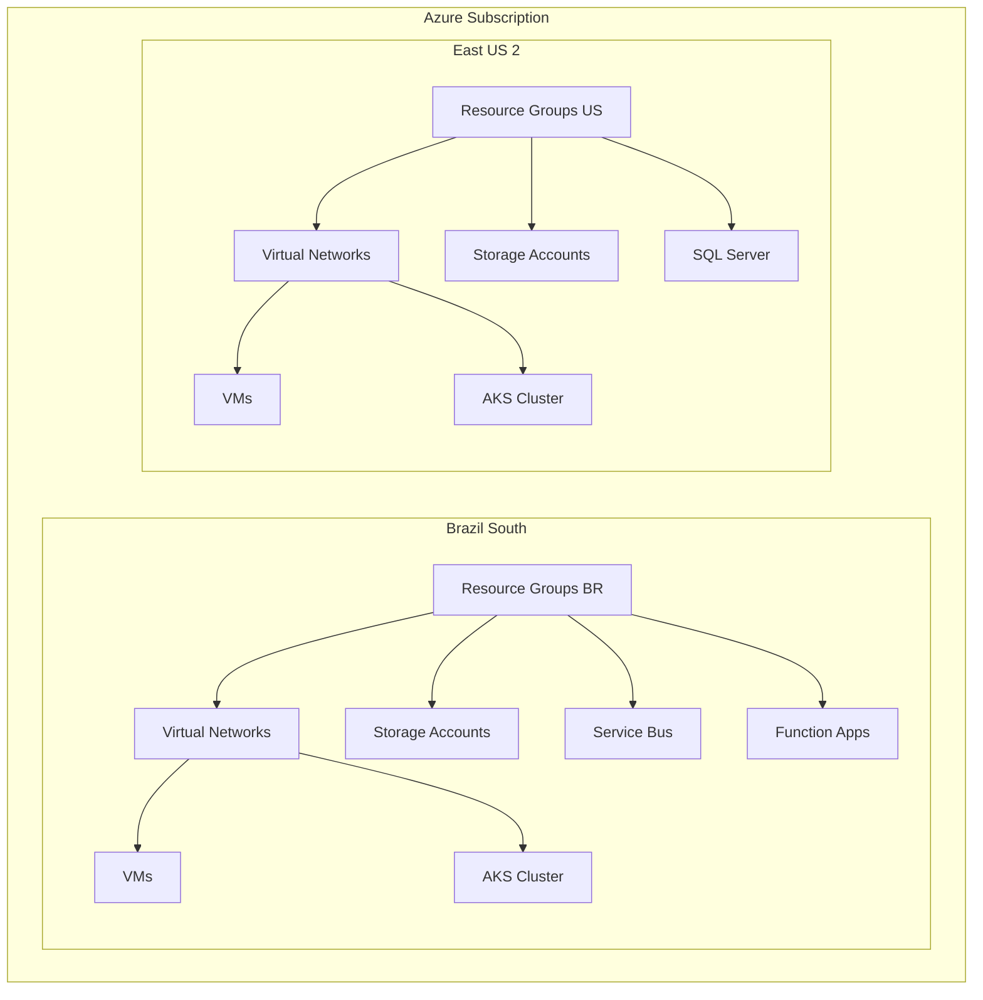

---

## 🗂️ Resource Groups

### Brazil South

| Resource Group | Localização | Propósito |
|----------------|-------------|-----------|
| **RG-VIAVAREJO-BR** | brazilsouth | Infraestrutura Via Varejo Brasil |
| **RG-AKS-BR** | brazilsouth | Cluster AKS Brasil |
| **RG-MESSAGERIA** | brazilsouth | Service Bus e mensageria |
| **RG-Alertas** | brazilsouth | Alertas e monitoramento |
| **RG-BRASIL** | brazilsouth | Recursos gerais Brasil |

### East US 2

| Resource Group | Localização | Propósito |
|----------------|-------------|-----------|
| **RGDATABASES** | eastus2 | SQL Server e databases |
| **RGWEB** | eastus2 | Aplicações web e VMs web |
| **RGSTORAGE** | eastus2 | Storage accounts |
| **RGBACKUP** | eastus2 | Backup e storage de backup |
| **RGNETWORK** | eastus2 | Recursos de rede |
| **RG-AKS-US** | eastus2 | Cluster AKS Estados Unidos |
| **FUSION-WCF_group** | eastus2 | VM Fusion WCF |
| **TRUX-RG** | eastus2 | Infraestrutura TRUX |

### Outras Regiões

| Resource Group | Localização | Propósito |
|----------------|-------------|-----------|
| **RGSTORAGE-EASTUS** | eastus | Storage accounts East US |
| **RGWEB-WESTUS2** | westus2 | Service Bus West US 2 |

---

## 🌐 Virtual Networks e Subnets

### Diagrama de Rede - Brazil South

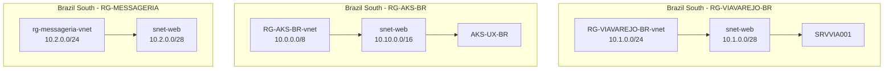

### Diagrama de Rede - East US 2

```mermaid
graph TB
    subgraph "East US 2 - RGDATABASES"
        VNET_DB[AZVNETUS<br/>10.0.0.0/16]
        SUBNET_DB[subnet-db<br/>10.0.1.0/24]
        VNET_DB --> SUBNET_DB
        SUBNET_DB --> SQL_SERVER[SQL Server]
    end
    
    subgraph "East US 2 - RGWEB"
        VNET_WEB[rgweb-vnet<br/>10.5.0.0/16]
        SUBNET_WEB[snet-web<br/>10.5.10.0/28]
        VNET_WEB --> SUBNET_WEB
        SUBNET_WEB --> VM_AZWEB[AZWEB01]
    end
    
    subgraph "East US 2 - RG-AKS-US"
        VNET_AKS_US[RG-AKS-US-vnet<br/>10.224.0.0/12]
        SUBNET_AKS_US[snet-web<br/>10.240.0.0/16]
        VNET_AKS_US --> SUBNET_AKS_US
        SUBNET_AKS_US --> AKS_US[AKS-UX-US]
    end
    
    subgraph "East US 2 - FUSION-WCF_group"
        VNET_FUSION[FUSION-WCF-vnet<br/>172.17.0.0/16]
        SUBNET_FUSION[snet-web<br/>172.17.10.0/24]
        VNET_FUSION --> SUBNET_FUSION
        SUBNET_FUSION --> VM_FUSION[FUSION-WCF]
    end
    
    subgraph "East US 2 - TRUX-RG"
        VNET_TRUX[TRUX-RG-vnet<br/>172.16.0.0/16]
        SUBNET_TRUX[snet-web<br/>172.16.10.0/24]
        VNET_TRUX --> SUBNET_TRUX
        SUBNET_TRUX --> VM_ROUTER[ROUTER-UX-01]
    end
```

---

## 💻 Virtual Machines

### VMs Provisionadas

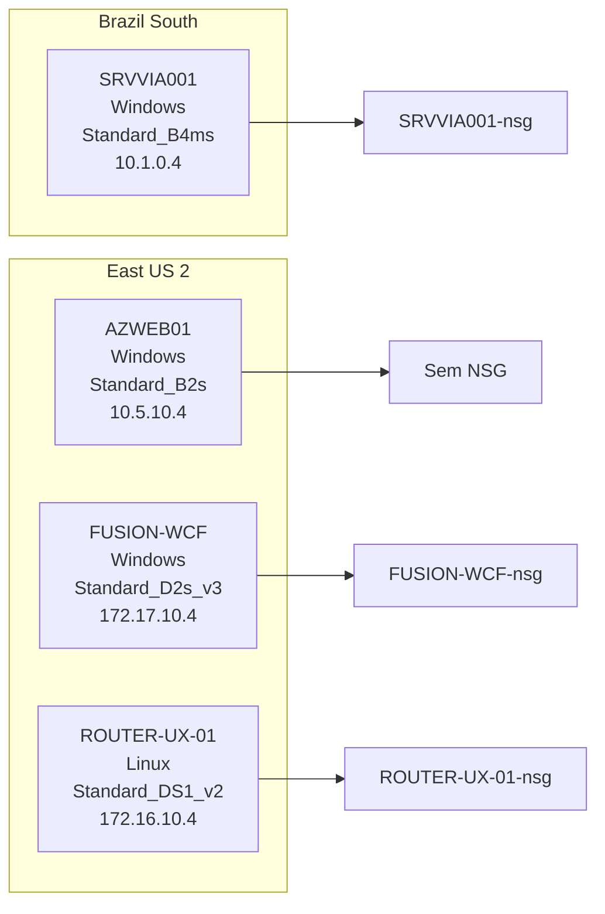

| VM | Resource Group | Localização | Size | OS | IP Privado | Status |
|----|----------------|-------------|------|----|-----------|--------|
| **SRVVIA001** | RG-VIAVAREJO-BR | brazilsouth | Standard_B4ms | Windows | 10.1.0.4 | ✅ Criada |
| **AZWEB01** | RGWEB | eastus2 | Standard_B2s | Windows | 10.5.10.4 | ✅ Criada |
| **FUSION-WCF** | FUSION-WCF_group | eastus2 | Standard_D2s_v3 | Windows | 172.17.10.4 | ✅ Criada |
| **ROUTER-UX-01** | TRUX-RG | eastus2 | Standard_DS1_v2 | Linux | 172.16.10.4 | ✅ Criada |
| **AZDB01** | RGDATABASES | eastus2 | Standard_D2s_v3 | Windows | - | ⚠️ Comentada (quota) |

**Nota:** A VM AZDB01 foi comentada temporariamente devido à limitação de quota de cores (10 cores disponíveis, 9 em uso).

---

## ☸️ AKS Clusters

### Clusters Kubernetes Provisionados

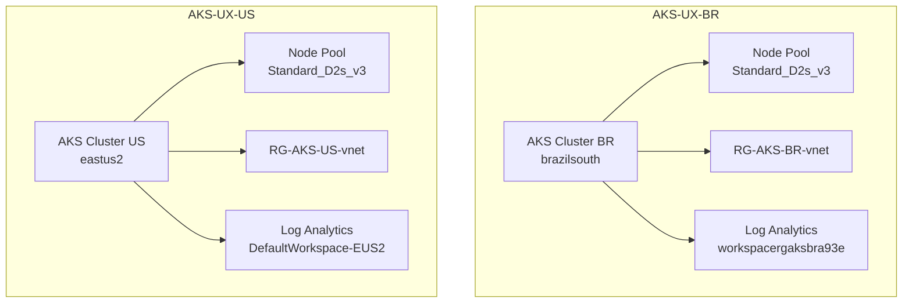

| Cluster | Resource Group | Localização | FQDN | Node Pool | Status |
|---------|----------------|-------------|------|-----------|--------|
| **AKS-UX-BR** | RG-AKS-BR | brazilsouth | aks-ux-br-04xusv4z.hcp.brazilsouth.azmk8s.io | Standard_D2s_v3 (1 node) | ✅ Criado |
| **AKS-UX-US** | RG-AKS-US | eastus2 | aks-ux-us-pjsrjz90.hcp.eastus2.azmk8s.io | Standard_D2s_v3 (1 node) | ✅ Criado |

---

## 🗄️ SQL Server e Databases

### SQL Server Provisionado

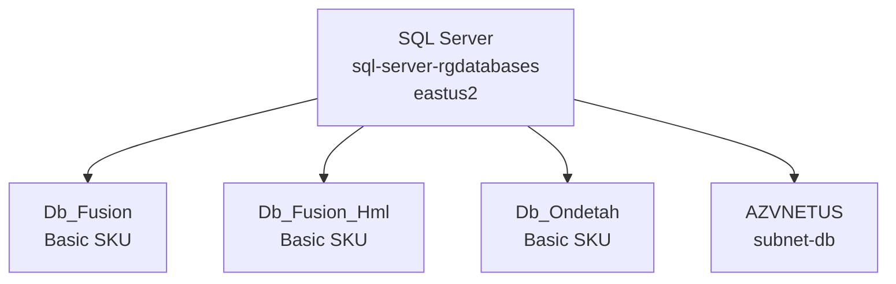

| Recurso | Resource Group | Localização | Detalhes |
|---------|----------------|-------------|----------|
| **SQL Server** | RGDATABASES | eastus2 | Nome: `sql-server-rgdatabases` |
| **Db_Fusion** | RGDATABASES | eastus2 | SKU: Basic, Max Size: 2GB |
| **Db_Fusion_Hml** | RGDATABASES | eastus2 | SKU: Basic, Max Size: 2GB |
| **Db_Ondetah** | RGDATABASES | eastus2 | SKU: Basic, Max Size: 2GB |

---

## 💾 Storage Accounts

### Storage Accounts Criados

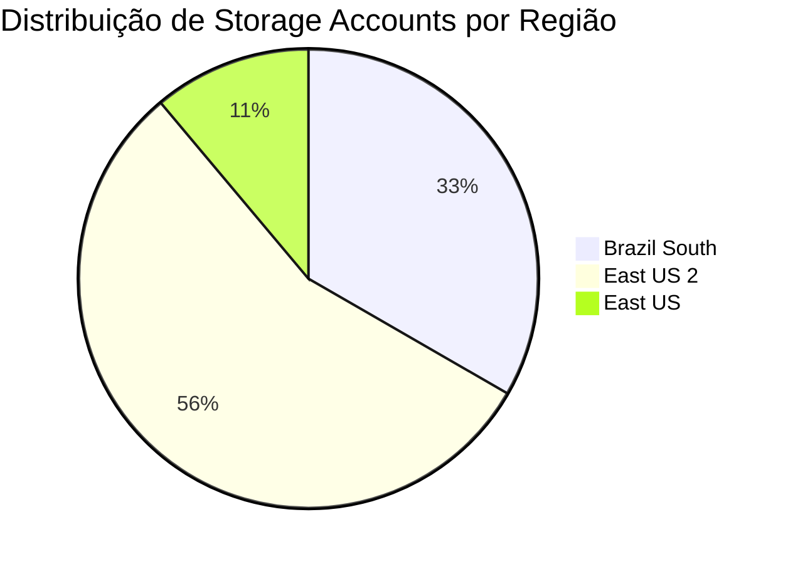

#### Brazil South

| Storage Account | Resource Group | Localização | Kind | Status |
|-----------------|----------------|-------------|------|--------|
| **menufrrgfo6ld53b07f1** | RG-VIAVAREJO-BR | brazilsouth | StorageV2 | ✅ Criado |
| **rgaksbr84b5d53b07f1** | RG-AKS-BR | brazilsouth | Storage | ✅ Criado |
| **rgviadiagd53b07f1** | RG-VIAVAREJO-BR | brazilsouth | Storage | ✅ Criado |

#### East US 2

| Storage Account | Resource Group | Localização | Kind | Status |
|-----------------|----------------|-------------|------|--------|
| **reenvioocorrenciasfuncti** | RG-AKS-US | eastus2 | StorageV2 | ✅ Criado (Function App) |
| **uxcarbonstg** | RG-AKS-BR | brazilsouth | StorageV2 | ✅ Criado (Function App) |

**Nota:** Alguns storage accounts do inventário original já existiam na conta e foram preservados (não recriados):
- `dbfusionbck`
- `csfaturaazure`
- `storagefusion`
- `truxstorageaccount`
- `rgdatabasesdiag745`
- `rgwebdiag964`
- `rgwebperfdiag438`
- `sqlvaez2w5q6adbsrk`

---

## 📨 Service Bus Namespaces

### Service Bus Provisionados

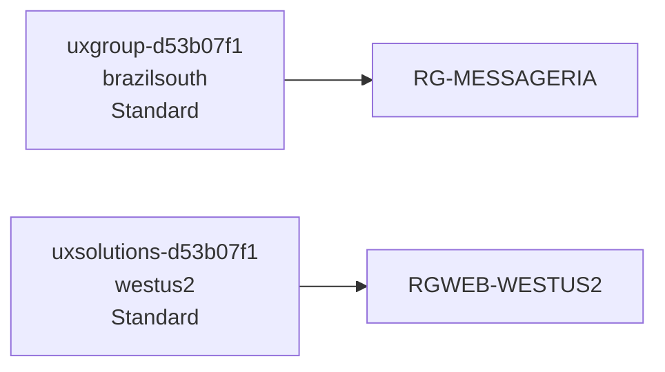

| Namespace | Resource Group | Localização | SKU | Status |
|-----------|----------------|-------------|-----|--------|
| **uxgroup-d53b07f1** | RG-MESSAGERIA | brazilsouth | Standard | ✅ Criado |
| **uxsolutions-d53b07f1** | RGWEB-WESTUS2 | westus2 | Standard | ✅ Criado |

**Nota:** Os nomes originais (`uxgroup` e `uxsolutions`) já estavam em uso, então foram adicionados sufixos únicos baseados no tenant ID.

---

## ⚡ Function Apps

### Function Apps Provisionadas

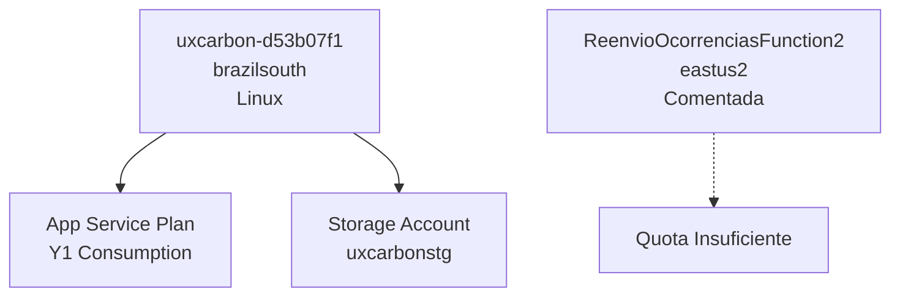

| Function App | Resource Group | Localização | Runtime | Status |
|--------------|----------------|-------------|---------|--------|
| **uxcarbon-d53b07f1** | RG-AKS-BR | brazilsouth | Linux (.NET 8.0) | ✅ Criada |
| **ReenvioOcorrenciasFunction2** | RG-AKS-US | eastus2 | - | ⚠️ Comentada (quota) |

**Nota:** A Function App `ReenvioOcorrenciasFunction2` foi comentada devido a limitações de quota de Dynamic VMs na conta.

---

## 🔐 Network Security Groups (NSGs)

### NSGs Criados

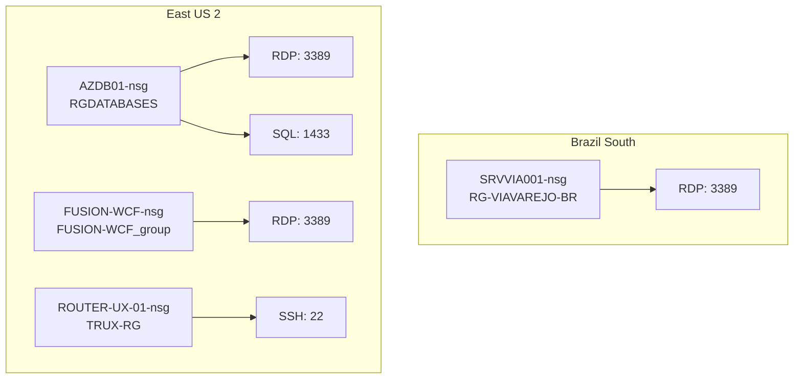

| NSG | Resource Group | Localização | Regras | Associado a |
|-----|----------------|-------------|--------|-------------|
| **SRVVIA001-nsg** | RG-VIAVAREJO-BR | brazilsouth | RDP (3389) | SRVVIA001 |
| **AZDB01-nsg** | RGDATABASES | eastus2 | RDP (3389), SQL (1433) | AZDB01 |
| **FUSION-WCF-nsg** | FUSION-WCF_group | eastus2 | RDP (3389) | FUSION-WCF |
| **ROUTER-UX-01-nsg** | TRUX-RG | eastus2 | SSH (22) | ROUTER-UX-01 |

---

## 📊 Log Analytics Workspaces

### Workspaces Criados

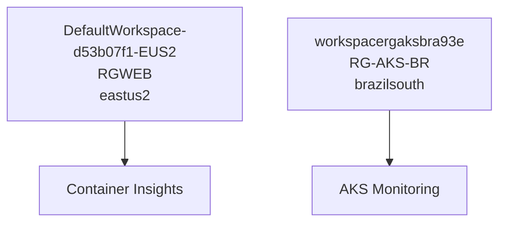

| Workspace | Resource Group | Localização | Propósito |
|-----------|----------------|-------------|-----------|
| **DefaultWorkspace-d53b07f1-EUS2** | RGWEB | eastus2 | Monitoramento geral East US 2 |
| **workspacergaksbra93e** | RG-AKS-BR | brazilsouth | Monitoramento AKS Brasil |

---

## 🌐 Public IPs

### Public IPs Criados

| Public IP | Resource Group | Localização | Allocation | SKU | Associado a |
|-----------|----------------|-------------|------------|-----|-------------|
| **PIP-SRVVIA001** | RG-VIAVAREJO-BR | brazilsouth | Static | Standard | SRVVIA001 |
| **AZDB01-ip** | RGDATABASES | eastus2 | Static | Standard | AZDB01 |
| **AZWEB01** | RGWEB | eastus2 | Static | Standard | AZWEB01 |
| **FUSION-WCF-ip** | FUSION-WCF_group | eastus2 | Static | Standard | FUSION-WCF |
| **ROUTER-UX-01-ip** | TRUX-RG | eastus2 | Static | Standard | ROUTER-UX-01 |

---

## 📈 Arquitetura Completa

### Diagrama de Arquitetura Geral

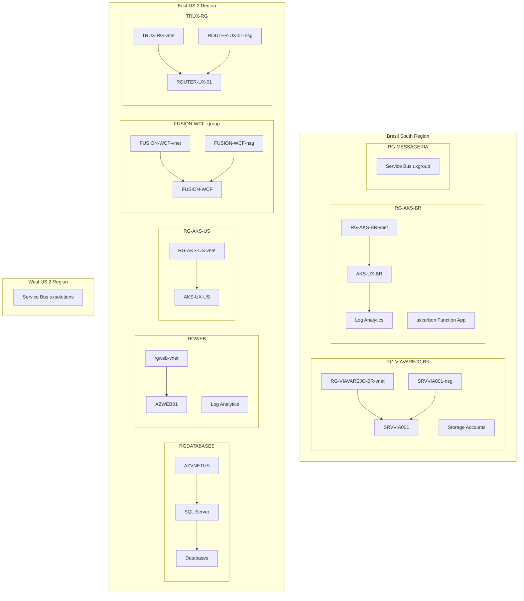

---

## 📋 Resumo de Recursos por Tipo

### Distribuição de Recursos

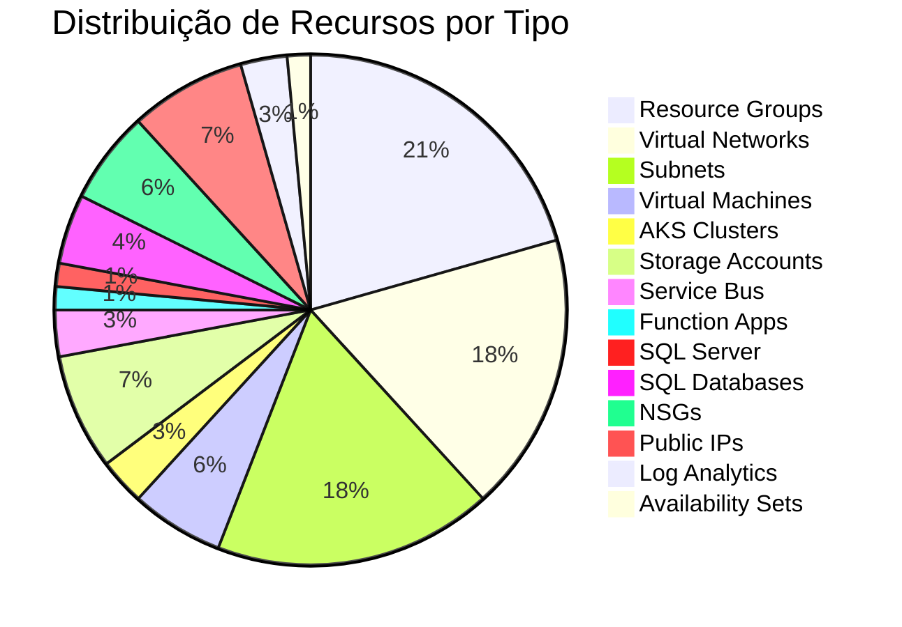

### Contagem Detalhada

| Tipo de Recurso | Quantidade | Status |
|-----------------|------------|--------|
| Resource Groups | 14 | ✅ Todos criados |
| Virtual Networks | 12 | ✅ Todos criados |
| Subnets | 12 | ✅ Todas criadas |
| Virtual Machines | 4 | ✅ 4 criadas, 1 comentada (quota) |
| AKS Clusters | 2 | ✅ Ambos criados |
| Storage Accounts | 5 | ✅ 5 criados, 8 preservados |
| Service Bus Namespaces | 2 | ✅ Ambos criados |
| Function Apps | 1 | ✅ 1 criada, 1 comentada (quota) |
| SQL Server | 1 | ✅ Criado |
| SQL Databases | 3 | ✅ Todos criados |
| Network Security Groups | 4 | ✅ Todos criados |
| Public IPs | 5 | ✅ Todos criados |
| Log Analytics Workspaces | 2 | ✅ Ambos criados |
| Availability Sets | 1 | ✅ Criado |

**Total:** 81 recursos gerenciados pelo Terraform

---

## ⚠️ Limitações e Ajustes

### Recursos Comentados/Temporariamente Indisponíveis

1. **VM AZDB01**
   - **Motivo:** Quota de cores excedida (10 cores disponíveis, 9 em uso, necessário 2 adicionais)
   - **Solução:** Solicitar aumento de quota ou reduzir tamanho de outras VMs

2. **Function App ReenvioOcorrenciasFunction2**
   - **Motivo:** Limitação de quota de Dynamic VMs (0 disponível)
   - **Solução:** Solicitar aumento de quota ou usar App Service Plan dedicado

3. **Storage Accounts Existentes**
   - **Motivo:** Alguns storage accounts já existiam na conta
   - **Solução:** Preservados, não recriados para evitar conflitos

### Ajustes de Nomenclatura

- **Service Bus:** Adicionados sufixos únicos (`-d53b07f1`) para evitar conflitos
- **Function Apps:** Adicionados sufixos únicos para evitar conflitos
- **Storage Accounts:** Alguns receberam sufixos únicos baseados no tenant ID

### Ajustes de SKU

- **VM AZWEB01:** Reduzida de `Standard_B4ms` para `Standard_B2s` (quota)
- **VM FUSION-WCF:** Reduzida de `Standard_D4s_v3` para `Standard_D2s_v3` (quota)

---

## 🔗 Conectividade e Endpoints

### Endpoints Públicos

| Recurso | Endpoint | Tipo |
|---------|----------|------|
| **AKS-UX-BR** | `aks-ux-br-04xusv4z.hcp.brazilsouth.azmk8s.io` | Kubernetes API |
| **AKS-UX-US** | `aks-ux-us-pjsrjz90.hcp.eastus2.azmk8s.io` | Kubernetes API |
| **SRVVIA001** | Public IP estático | RDP (3389) |
| **AZWEB01** | Public IP estático | RDP (3389) |
| **FUSION-WCF** | Public IP estático | RDP (3389) |
| **ROUTER-UX-01** | Public IP estático | SSH (22) |

### Conectividade Interna

- Todas as VMs estão em VNets privadas com subnets dedicadas
- AKS clusters têm integração com VNets (network plugin: azure)
- SQL Server está em subnet dedicada (`subnet-db`)

---

## 📝 Próximos Passos

### Recomendações

1. **Aumentar Quota de Cores**
   - Solicitar aumento para pelo menos 15 cores em East US 2
   - Isso permitirá criar a VM AZDB01

2. **Aumentar Quota de Dynamic VMs**
   - Solicitar quota para Function Apps se necessário
   - Ou migrar para App Service Plan dedicado

3. **Configurar Peering de VNets**
   - Se necessário comunicação entre VNets diferentes
   - Configurar peering entre VNets da mesma região

4. **Configurar Load Balancers**
   - Adicionar Load Balancers se necessário para alta disponibilidade
   - Configurar regras de balanceamento para VMs

5. **Backup e Disaster Recovery**
   - Configurar Azure Backup para VMs
   - Configurar backup automático para SQL Databases

6. **Monitoramento e Alertas**
   - Configurar alertas adicionais nos Log Analytics Workspaces
   - Configurar dashboards no Azure Monitor

---
